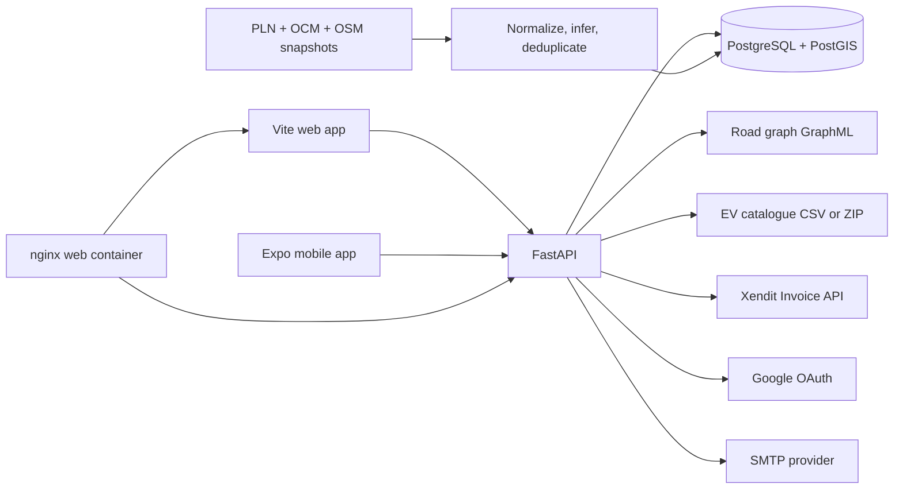
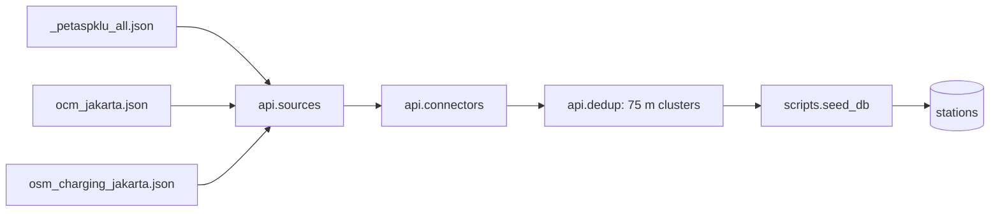

# Architecture

EVFlow is a monorepo with separately deployable backend, web, and mobile
applications. The backend owns authoritative station, account, wallet, pricing,
and charging state. The web and mobile apps share most screens and API clients.

## System Context



In the root container stack, nginx serves the built SPA and proxies `/api/` and
`/health` to FastAPI. During native development, Vite and Expo call FastAPI
directly on port 8000.

## Backend Structure

The backend is intentionally small and synchronous. HTTP routes call domain
helpers or repository functions; repository functions execute parameterized SQL
through one module-level SQLAlchemy engine.

| Path | Responsibility |
|---|---|
| `api/main.py` | FastAPI application, route definitions, access dependencies, response assembly |
| `api/models.py` | Pydantic request and response models; drives generated OpenAPI |
| `api/db.py` | SQLAlchemy engine configured by `DATABASE_URL` |
| `api/stations_repo.py` | Station filters, PostGIS distance queries, lookups, and aggregates |
| `api/users_repo.py` | User creation, lookup, password change, and profile updates |
| `api/wallet_repo.py` | User wallet creation, top-up persistence, idempotent credits |
| `api/charging_repo.py` | Atomic deposit debit, settlement, refund, and session history |
| `api/password_reset_repo.py` | Hashed, expiring, single-use reset tokens |
| `api/security.py` | bcrypt passwords, HS256 JWTs, bearer auth, OAuth state signing |
| `api/pricing.py` | Server-authoritative charging quote and settlement calculations |
| `api/xendit.py` | Thin Xendit invoice client |
| `api/google_oauth.py` | Google authorization-code exchange and user-info lookup |
| `api/mailer.py` | SMTP email transport |
| `api/routing.py` | Lazy GraphML loading, point snapping, custom Dijkstra routing |
| `api/evmodels.py` | Cached EV model catalogue and range calculation |
| `api/sources.py` | Raw PLN, Open Charge Map, and OSM normalization |
| `api/connectors.py` | Connector inference and charging-speed classification |
| `api/dedup.py` | Deterministic 75 metre station clustering |

There is no ORM model layer or dependency-injected session. Alembic migrations
are hand-written SQL, and `target_metadata` is `None`.

### Request Path

```text
HTTP request
  -> FastAPI validation and optional current_user dependency
  -> domain helper or repository
  -> SQLAlchemy connection / external provider / cached file data
  -> Pydantic response model
  -> JSON response
```

Synchronous FastAPI handlers may be run in FastAPI's thread pool. External Xendit
and Google calls also use synchronous `httpx` functions.

## Persistence Model

The schema is a linear Alembic chain from `0001_stations` through
`0008_user_password_changed_at`.

| Table | Purpose and important constraints |
|---|---|
| `stations` | Text ID, WGS84 PostGIS point, source and connector arrays, connector JSONB, derived speed/power fields, spatial and lookup indexes |
| `users` | UUID ID, nullable unique username and Google subject, password/email, role/profile and consent fields, password-change timestamp |
| `wallet` | Non-negative IDR balance, unique user association; retains the original smallint identifier design |
| `topups` | UUID ID, user association, unique internal and Xendit invoice IDs, payment status and timestamps |
| `charging_sessions` | UUID ID, user association, station snapshot, requested/delivered energy, deposit, actual cost, refund and status |
| `password_reset_tokens` | UUID ID, user FK, unique SHA-256 token hash, expiry and use timestamps |

`charging_sessions.station_id` is a snapshot identifier, not a foreign key. This
keeps historical charging records valid if station data is reseeded. User FKs use
delete behavior defined in migrations; inspect the latest migration chain before
changing account-deletion behavior.

Migrations and station seeding do not run at API startup.

## Station Data Pipeline



PLN records have source priority, followed by Open Charge Map and OSM. The first
record becomes a stable cluster anchor; later nearby records fill missing
descriptive fields and merge connector details. Connector type is inferred from
power and charge-type hints using Indonesia's Type 2 AC / CCS2 convention. The API
sets inference flags because those values are not ground truth.

The current checkout contains 3,569 normalized raw records and produces 2,931
deduplicated records with the current algorithm. Reseeding truncates only
`stations`; account, wallet, and charging data remain intact.

## Routing And EV Range

Routing is independent from PostGIS proximity queries:

1. `scripts/build_road_graph.py` downloads the Jakarta drivable network through
   OSMnx and writes GraphML.
2. `api/routing.py` lazily loads GraphML with NetworkX on the first route request.
3. Input coordinates and station coordinates are snapped to graph nodes with
   vectorized haversine distance.
4. A custom Dijkstra implementation minimizes either edge length or travel time.
5. Route geometry is returned as GeoJSON `[longitude, latitude]` pairs.

The graph and station snaps are cached per API worker. More workers increase
memory use and maintain independent caches. If the GraphML file is absent, only
routing returns 503.

Range-aware nearest-station routing accepts an explicit remaining range or derives
one from an EV catalogue entry and state of charge. The catalogue is cached from a
CSV when present, with `ev_dataset.zip` as a fallback. The default range safety
factor is 0.85.

## Authentication And Account Flow

Username/password accounts use bcrypt. Login returns an HS256 bearer JWT with a
subject, issued-at time, and expiry. There is no refresh token. Protected routes
resolve the current database user on every request and reject tokens issued before
`password_changed_at`, so password reset invalidates older sessions.

Google OAuth is server-side authorization code flow:

```text
browser -> /auth/google/login -> Google -> /auth/google/callback
        -> create/find user -> JWT in frontend redirect fragment
```

The backend flow exists, but the current frontend has no `/auth/callback` route or
Google sign-in control. It should be treated as incomplete integration rather than
a working user flow.

Password reset stores only a SHA-256 hash of the random token. Email delivery runs
as a FastAPI background task; SMTP failures are logged after the HTTP response.

## Wallet And Charging Transactions

### Top-up

```text
authenticated user
  -> create Xendit invoice and pending topup
  -> pay on hosted invoice page
  -> verified webhook OR authenticated status poll sees PAID/SETTLED
  -> atomically mark paid and credit that user's wallet once
```

The conditional status update makes credit idempotent across duplicate webhooks
and polling. The webhook uses `X-Callback-Token`, not bearer auth.

### Charging

```text
public quote
  -> authenticated session start
  -> conditional wallet debit for full deposit + active session insert
  -> frontend charging simulation
  -> authenticated settlement
  -> completed session update + unused-energy refund
```

Start and settlement each move wallet value in the same transaction as the session
write. Settlement caps billable delivered energy at the purchased amount and is
idempotent. The backend accounting is real; device control, charger telemetry, QR
identity, and progress are currently simulated or selected in the client.

## Frontend Structure

The frontend is an npm-workspace monorepo whose packages expose TypeScript source
directly. Apps do not build internal packages separately.

```text
apps/web or apps/mobile
  -> @evflow/features
     -> @evflow/shared
     -> @evflow/ui

@evflow/maps -> @evflow/ui  (declared but not used by product screens)
```

| Workspace | Responsibility |
|---|---|
| `apps/web` | React DOM/Vite startup, React Native Web aliasing, global CSS |
| `apps/mobile` | Expo startup, fonts, safe-area provider, native metadata |
| `packages/features` | Routes, business dashboard, driver, auth, onboarding, wallet, and charging screens |
| `packages/shared` | Handwritten API clients/types, auth session, validation, transforms and helpers |
| `packages/ui` | Shared primitives, navigation, actual Leaflet map implementations, themes, centralized screen styles |
| `packages/maps` | Placeholder `MapView` package; not the map used by `DriverMapScreen` |

Vite prefers `.web.tsx` and maps `react-native` to `react-native-web`. Metro selects
`.native.tsx` and watches the full workspace. Platform variants implement routing,
API URL detection, camera scanning, location, Leaflet, icons, sliders, progress
rings, safe areas, model selection, and receipt generation.

### Client Routing

Web uses `BrowserRouter`; mobile uses `NativeRouter`. Product routes are defined in
`packages/features/src/routing/AppRoutes.tsx`. There are no route-level auth or
role guards. Most charging screens rely on in-memory navigation state, so a reload
cannot reconstruct the flow.

The native router is memory-based. Mobile deep-link metadata exists in
`app.json`, but routes are not wired to deep-link restoration.

### API And Session State

All active API functions live under `packages/shared/src`. Their TypeScript
contracts are handwritten rather than generated from OpenAPI.

- Web stores the full token response in `sessionStorage`.
- Native falls back to process memory, so a reload signs the user out.
- There is no refresh flow, global 401 handler, or automatic redirect on expiry.
- API base URL is resolved once when shared API modules are imported.

The web map dynamically imports the installed Leaflet package. The native map
embeds Leaflet in a WebView and loads Leaflet assets from unpkg plus CARTO tiles,
so it requires internet access even when the API and app bundle are local.

## Dependency And Ownership Rules

Use these rules to keep boundaries coherent:

- Endpoints validate and orchestrate; SQL belongs in repository modules.
- Pricing and wallet movement remain backend-authoritative.
- Alembic migrations, not ad hoc startup code, own schema changes.
- Raw data normalization and inference should stay pure and testable before seed
  persistence.
- Apps should remain thin platform shells; screens and flows belong in features.
- Shared API/domain logic belongs in `@evflow/shared`; reusable UI belongs in
  `@evflow/ui`.
- A platform-neutral module must not import browser-only or native-only APIs.
- A new protected API call must use the auth session helper and handle 401 state.
- User-visible route state that must survive refresh should have a URL or persisted
  recovery key, not navigation state alone.

See [Project Status](PROJECT_STATUS.md) for current exceptions and unfinished
areas.
