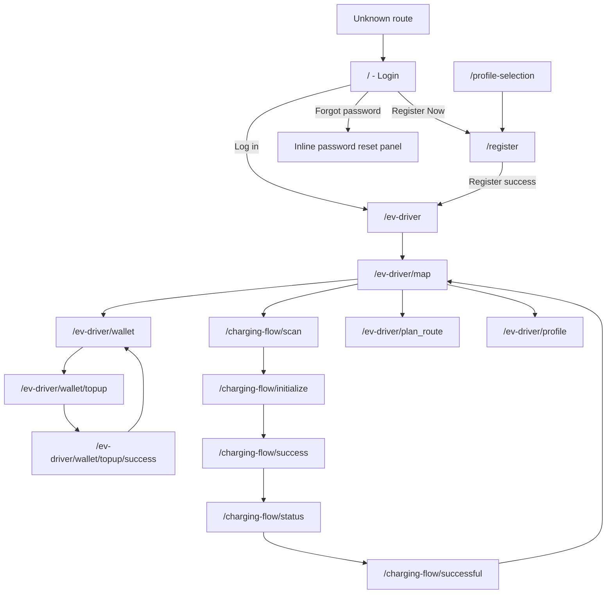

# EV-FLOW Frontend Sitemap

Source reviewed: `frontend-evflow-app/packages/features/src/routing/AppRoutes.tsx`, `EVDriverContainer.tsx`, and the feature screens under `frontend-evflow-app/packages/features/src`.

## Route Map

| Path | Screen / Container | Status | Purpose | Main outgoing navigation |
| --- | --- | --- | --- | --- |
| `/` | `LoginScreen` | Active | Log in with username/email and password, or request password reset. | Successful login -> `/ev-driver`; register link -> `/register` |
| `/profile-selection` | `ProfileSelectionScreen` | Active route, not currently used by register link | Select a user role before registration. Current router keeps a selected role in local state. | Back -> `/`; continue -> `/register` |
| `/register` | `RegistrationScreen` | Active | Create a driver account with username, email, password, EV model, connector preference, location consent, and terms acceptance. | Back/login -> `/`; successful registration -> `/ev-driver` |
| `/ev-driver` | Redirect | Active | Default EV driver entry point. | Redirects to `/ev-driver/map` |
| `/ev-driver/map` | `EVDriverContainer` + `DriverMapScreen` | Active | Discover SPKLU stations on a map, search, filter, request location, and view station detail. | Bottom/side nav to wallet, scan flow, plan route, profile |
| `/ev-driver/wallet` | `EVDriverContainer` + `WalletScreen` | Active | View wallet balance, top-up and charging transaction history, sort transactions, open transaction detail, download receipts. | Top Up -> `/ev-driver/wallet/topup`; nav to map/scan/plan/profile |
| `/ev-driver/wallet/topup` | `EVDriverContainer` + `TopUpWalletScreen` | Active | Enter top-up amount and create a Xendit invoice. | Back -> `/ev-driver/wallet`; success/waiting -> `/ev-driver/wallet/topup/success` |
| `/ev-driver/wallet/topup/success` | `EVDriverContainer` + `TopUpSuccessScreen` | Active | Poll payment status and show waiting or success state. Supports `?topup_id=...` redirect lookup. | Back -> `/ev-driver/wallet/topup`; done/back to wallet -> `/ev-driver/wallet` |
| `/ev-driver/scan` | `EVDriverContainer` + `MockDriverScreen` | Placeholder route | Direct URL placeholder for the scan tab. Normal navigation does not use this path. | Bottom/side nav |
| `/ev-driver/plan_route` | `EVDriverContainer` + `MockDriverScreen` | Placeholder | Future route planning screen. | Bottom/side nav |
| `/ev-driver/profile` | `EVDriverContainer` + `MockDriverScreen` | Placeholder | Future profile screen. | Bottom/side nav |
| `/charging-flow/scan` | `ScanSpkluScreen` | Active | Scan SPKLU QR/barcode with camera or use manual station entry. | Back -> `/ev-driver/map`; detected/manual -> `/charging-flow/initialize` |
| `/charging-flow/initialize` | `InitializeChargingScreen` | Active | Load a station/connector, enter required energy, calculate quote, validate wallet balance, and start charging session. | Back -> `/charging-flow/scan`; close -> `/ev-driver/map`; payment success -> `/charging-flow/success` |
| `/charging-flow/success` | `TransactionSuccessScreen` | Active | Show payment completion and wait for physical plug-in simulation. | Start charging -> `/charging-flow/status` |
| `/charging-flow/status` | `ChargingStatusScreen` | Active | Simulate live charging progress and charging metrics. | Auto-complete or stop -> `/charging-flow/successful` |
| `/charging-flow/successful` | `ChargingSuccessfulScreen` | Active | Settle charging session, show delivered energy, actual cost, refund, updated wallet balance, and receipt action. | Back to map -> `/ev-driver/map` |
| `*` | Redirect | Active | Catch-all for unknown paths. | Redirects to `/` |

## Navigation Structure

## Primary Screens

### Authentication

- **Login** (`/`): validates non-empty username/email and password, calls login API, stores session in `sessionStorage` or memory, then opens the driver area.
- **Forgot password**: inline panel inside the login screen; validates email and calls password reset API.
- **Registration** (`/register`): preloads EV models and connector types, validates required fields, saves auth session after successful registration, then opens the driver area.
- **Profile selection** (`/profile-selection`): available route for role selection, but the current login register link goes directly to `/register`.

### EV Driver Area

- **Container**: `EVDriverContainer` renders desktop side menu or mobile bottom navigation.
- **Navigation items**: Map, Wallet, Scan, Plan Route, Profile.
- **Scan behavior**: the scan nav item opens `/charging-flow/scan`, not `/ev-driver/scan`.
- **Placeholder tabs**: `/ev-driver/plan_route`, `/ev-driver/profile`, and direct `/ev-driver/scan` render an under-development placeholder.

### Map Discovery

- Shows a Leaflet map centered on Jakarta by default or the user location if available.
- Loads connector and speed-tier filter options.
- Loads nearby stations when location is available, otherwise loads the station list.
- Supports search, filter drawer, results drawer, station markers, and station detail drawer.

### Wallet

- Loads wallet balance, wallet top-ups, and charging sessions.
- Combines top-up and charging sessions into one transaction list.
- Supports transaction sorting, transaction detail modal, reference copy, and receipt download.
- Top-up flow creates a Xendit invoice, opens the invoice URL, then polls top-up status until paid.

### Charging Flow

- **Scan**: checks camera permission, starts QR scanner, supports torch when available, and supports manual station entry.
- **Initialize**: chooses a nearby or fallback station, chooses a connector, loads wallet balance, calculates quote, and starts a charging session.
- **Transaction success**: displays successful deposit payment, waits for plug-in simulation, then allows session start.
- **Charging status**: simulates progress, speed tapering, delivered kWh, amount utilized, and time remaining.
- **Charging successful**: settles the session, calculates actual cost/refund, updates wallet balance display, and offers receipt download.

## Frontend API Dependencies

| Feature | API client functions | Backend endpoints |
| --- | --- | --- |
| Login | `login` | `POST /api/v1/auth/login` |
| Registration | `fetchEvModels`, `fetchConnectorTypes`, `register` | `GET /api/v1/ev-models`, `GET /api/v1/connectors`, `POST /api/v1/auth/register` |
| Forgot password | `requestPasswordReset` | `POST /api/v1/auth/forgot-password` |
| Map filters | `fetchConnectorTypes`, `fetchSpeedTiers` | `GET /api/v1/connectors`, `GET /api/v1/speed-tiers` |
| Map station discovery | `fetchNearbyStations`, `fetchStations`, `fetchStation` | `GET /api/v1/stations/nearby`, `GET /api/v1/stations`, `GET /api/v1/stations/{id}` |
| Wallet overview | `fetchWalletBalance`, `fetchWalletTopups`, `fetchChargingSessions` | `GET /api/v1/wallet`, `GET /api/v1/wallet/topups`, `GET /api/v1/charging/sessions` |
| Wallet top-up | `createWalletTopup`, `fetchWalletTopup` | `POST /api/v1/wallet/topup`, `GET /api/v1/wallet/topups/{topup_id}` |
| Charging initialization | `fetchWalletBalance`, `fetchChargingQuote`, `startChargingSession` | `GET /api/v1/wallet`, `POST /api/v1/charging/quote`, `POST /api/v1/charging/sessions` |
| Charging status | `fetchSpeedTiers` | `GET /api/v1/speed-tiers` |
| Charging settlement | `settleChargingSession` | `POST /api/v1/charging/sessions/{session_id}/settle` |

## Notes For Future Sitemap Updates

- Add real pages for `/ev-driver/plan_route` and `/ev-driver/profile` when those placeholders are implemented.
- Decide whether `/profile-selection` should be part of the public registration path again; the router has it, but `LoginRoute` currently sends users directly to `/register`.
- If the charging QR payload starts carrying station/connector IDs, document those route state or query parameters in the charging-flow routes.
