# EV-FLOW User Flow Diagrams

This document is a Markdown reference for creating Activity Diagrams and System Sequence Diagrams from the current frontend implementation.

Diagram syntax: Mermaid. Activity diagrams are represented as `flowchart TD`; System Sequence Diagrams are represented as `sequenceDiagram`.

## Actors And Systems

| Name | Description |
| --- | --- |
| EV Driver | Primary app user. |
| EV-FLOW Frontend | React / React Native frontend under `frontend-evflow-app`. |
| EV-FLOW API | Backend API consumed by `@evflow/shared`. |
| Browser / Device | Camera, geolocation, linking, clipboard, session storage. |
| Xendit | External wallet top-up checkout provider. |

## 1. Login

### Activity Diagram

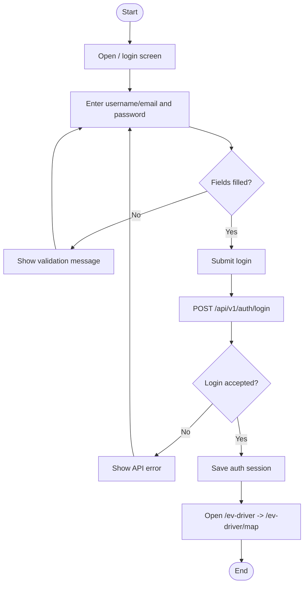
```mermaid
flowchart TD
  Start([Start]) --> OpenLogin[Open / login screen]
  OpenLogin --> FillCredentials[Enter username/email and password]
  FillCredentials --> Validate{Fields filled?}
  Validate -->|No| ShowValidation[Show validation message]
  ShowValidation --> FillCredentials
  Validate -->|Yes| Submit[Submit login]
  Submit --> ApiLogin[POST /api/v1/auth/login]
  ApiLogin --> LoginOk{Login accepted?}
  LoginOk -->|No| ShowError[Show API error]
  ShowError --> FillCredentials
  LoginOk -->|Yes| SaveSession[Save auth session]
  SaveSession --> DriverHome[Open /ev-driver -> /ev-driver/map]
  DriverHome --> End([End])
```

### System Sequence Diagram

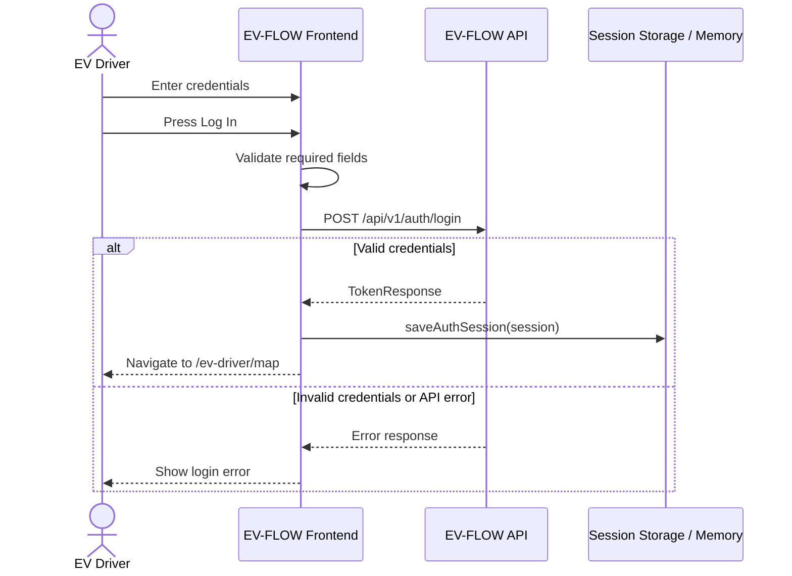
```mermaid
sequenceDiagram
  actor Driver as EV Driver
  participant UI as EV-FLOW Frontend
  participant API as EV-FLOW API
  participant Store as Session Storage / Memory

  Driver->>UI: Enter credentials
  Driver->>UI: Press Log In
  UI->>UI: Validate required fields
  UI->>API: POST /api/v1/auth/login
  alt Valid credentials
    API-->>UI: TokenResponse
    UI->>Store: saveAuthSession(session)
    UI-->>Driver: Navigate to /ev-driver/map
  else Invalid credentials or API error
    API-->>UI: Error response
    UI-->>Driver: Show login error
  end
```

## 2. Forgot Password

### Activity Diagram

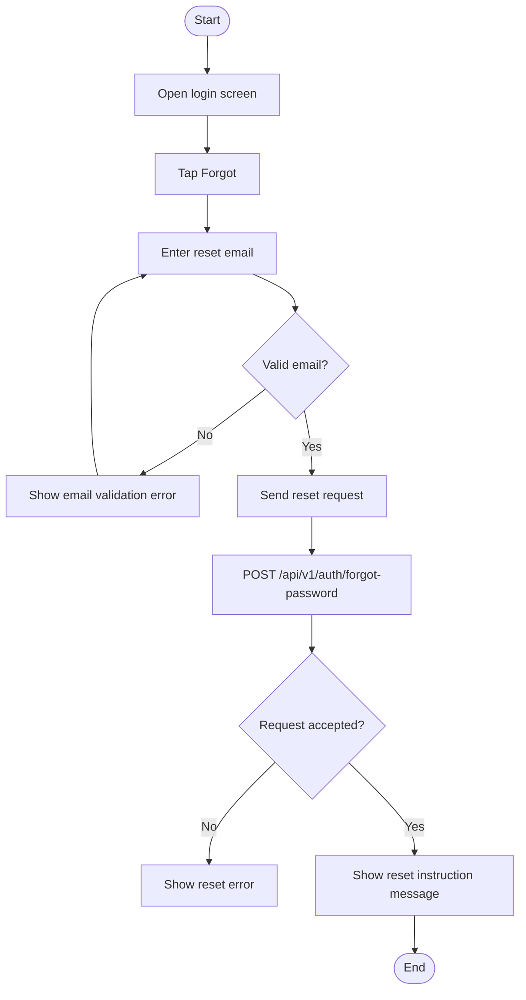
```mermaid
flowchart TD
  Start([Start]) --> OpenLogin[Open login screen]
  OpenLogin --> ToggleForgot[Tap Forgot]
  ToggleForgot --> EnterEmail[Enter reset email]
  EnterEmail --> ValidateEmail{Valid email?}
  ValidateEmail -->|No| ShowEmailError[Show email validation error]
  ShowEmailError --> EnterEmail
  ValidateEmail -->|Yes| SubmitReset[Send reset request]
  SubmitReset --> ApiReset[POST /api/v1/auth/forgot-password]
  ApiReset --> ResetOk{Request accepted?}
  ResetOk -->|No| ShowResetError[Show reset error]
  ResetOk -->|Yes| ShowResetMessage[Show reset instruction message]
  ShowResetMessage --> End([End])
```

### System Sequence Diagram

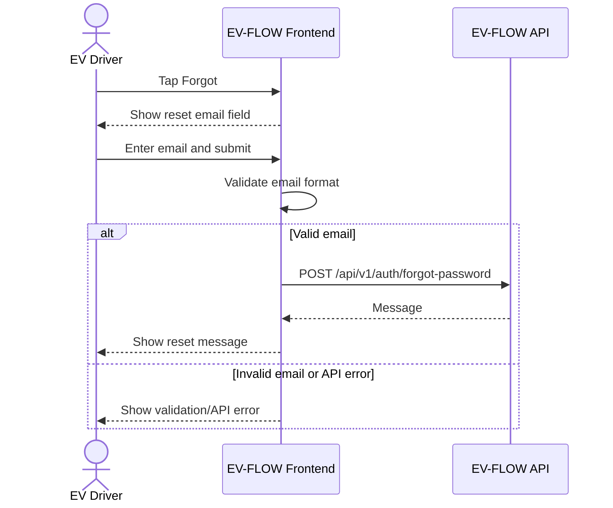
```mermaid
sequenceDiagram
  actor Driver as EV Driver
  participant UI as EV-FLOW Frontend
  participant API as EV-FLOW API

  Driver->>UI: Tap Forgot
  UI-->>Driver: Show reset email field
  Driver->>UI: Enter email and submit
  UI->>UI: Validate email format
  alt Valid email
    UI->>API: POST /api/v1/auth/forgot-password
    API-->>UI: Message
    UI-->>Driver: Show reset message
  else Invalid email or API error
    UI-->>Driver: Show validation/API error
  end
```

## 3. Registration

### Activity Diagram

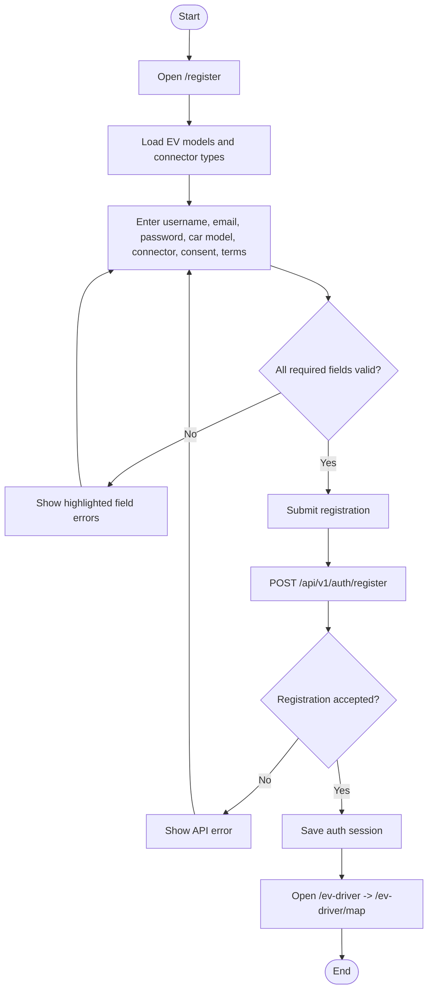
```mermaid
flowchart TD
  Start([Start]) --> OpenRegister[Open /register]
  OpenRegister --> LoadOptions[Load EV models and connector types]
  LoadOptions --> FillForm[Enter username, email, password, car model, connector, consent, terms]
  FillForm --> Validate{All required fields valid?}
  Validate -->|No| ShowValidation[Show highlighted field errors]
  ShowValidation --> FillForm
  Validate -->|Yes| SubmitRegister[Submit registration]
  SubmitRegister --> ApiRegister[POST /api/v1/auth/register]
  ApiRegister --> RegisterOk{Registration accepted?}
  RegisterOk -->|No| ShowRegisterError[Show API error]
  ShowRegisterError --> FillForm
  RegisterOk -->|Yes| SaveSession[Save auth session]
  SaveSession --> DriverHome[Open /ev-driver -> /ev-driver/map]
  DriverHome --> End([End])
```

### System Sequence Diagram

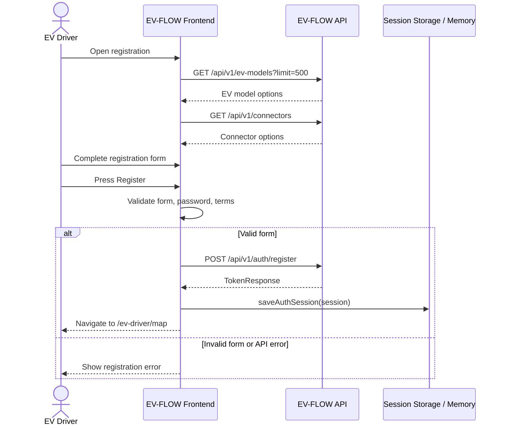
```mermaid
sequenceDiagram
  actor Driver as EV Driver
  participant UI as EV-FLOW Frontend
  participant API as EV-FLOW API
  participant Store as Session Storage / Memory

  Driver->>UI: Open registration
  UI->>API: GET /api/v1/ev-models?limit=500
  API-->>UI: EV model options
  UI->>API: GET /api/v1/connectors
  API-->>UI: Connector options
  Driver->>UI: Complete registration form
  Driver->>UI: Press Register
  UI->>UI: Validate form, password, terms
  alt Valid form
    UI->>API: POST /api/v1/auth/register
    API-->>UI: TokenResponse
    UI->>Store: saveAuthSession(session)
    UI-->>Driver: Navigate to /ev-driver/map
  else Invalid form or API error
    UI-->>Driver: Show registration error
  end
```

## 4. Profile Selection

### Activity Diagram

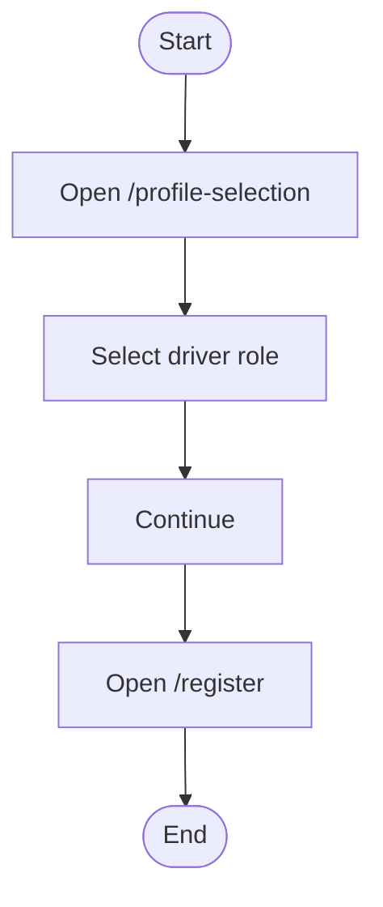
```mermaid
flowchart TD
  Start([Start]) --> OpenProfileSelection[Open /profile-selection]
  OpenProfileSelection --> SelectRole[Select driver role]
  SelectRole --> Continue[Continue]
  Continue --> Register[Open /register]
  Register --> End([End])
```

### System Sequence Diagram

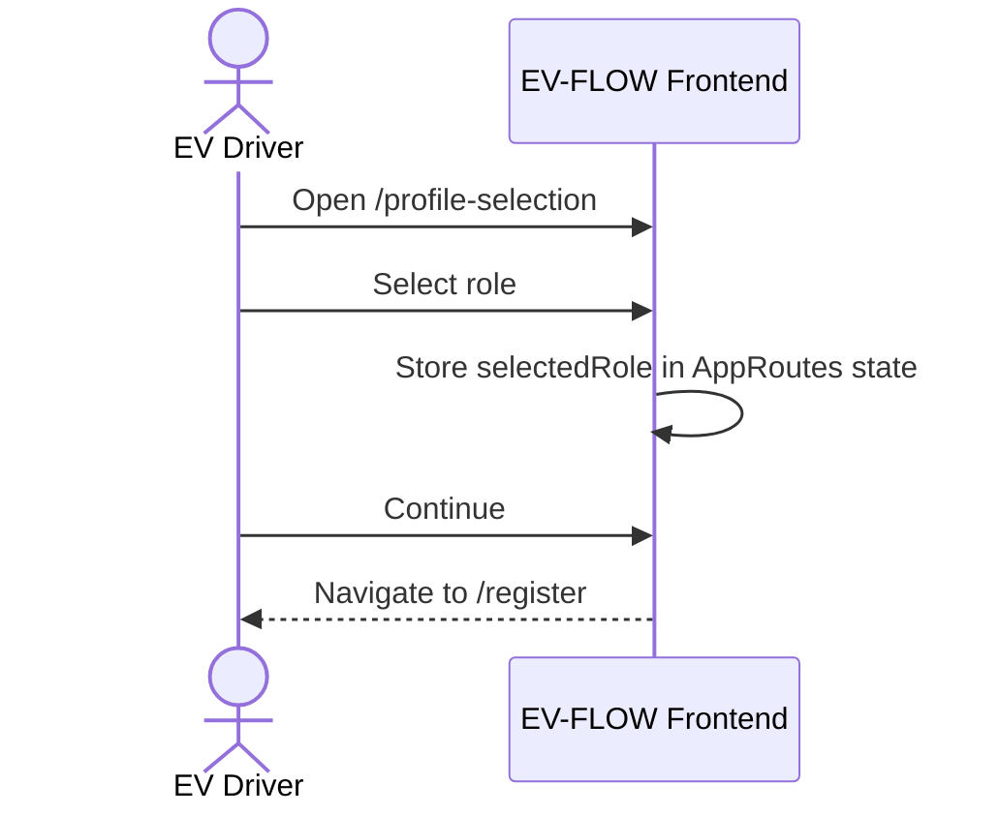
```mermaid
sequenceDiagram
  actor Driver as EV Driver
  participant UI as EV-FLOW Frontend

  Driver->>UI: Open /profile-selection
  Driver->>UI: Select role
  UI->>UI: Store selectedRole in AppRoutes state
  Driver->>UI: Continue
  UI-->>Driver: Navigate to /register
```

Note: this route exists, but the current login screen sends new users directly to `/register`.

## 5. Map Station Discovery

### Activity Diagram

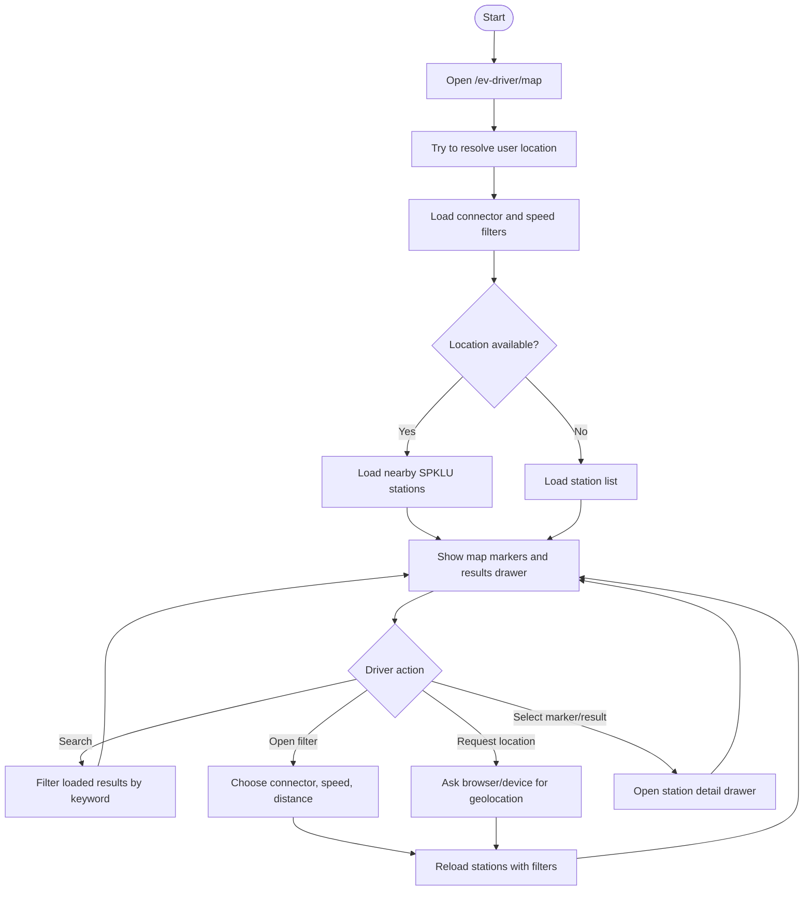
```mermaid
flowchart TD
  Start([Start]) --> OpenMap[Open /ev-driver/map]
  OpenMap --> ResolveLocation[Try to resolve user location]
  ResolveLocation --> LoadFilters[Load connector and speed filters]
  LoadFilters --> HasLocation{Location available?}
  HasLocation -->|Yes| LoadNearby[Load nearby SPKLU stations]
  HasLocation -->|No| LoadAll[Load station list]
  LoadNearby --> ShowMap[Show map markers and results drawer]
  LoadAll --> ShowMap
  ShowMap --> UserAction{Driver action}
  UserAction -->|Search| SearchStations[Filter loaded results by keyword]
  UserAction -->|Open filter| ApplyFilters[Choose connector, speed, distance]
  UserAction -->|Request location| RequestLocation[Ask browser/device for geolocation]
  UserAction -->|Select marker/result| StationDetail[Open station detail drawer]
  ApplyFilters --> ReloadStations[Reload stations with filters]
  RequestLocation --> ReloadStations
  SearchStations --> ShowMap
  ReloadStations --> ShowMap
  StationDetail --> ShowMap
```

### System Sequence Diagram

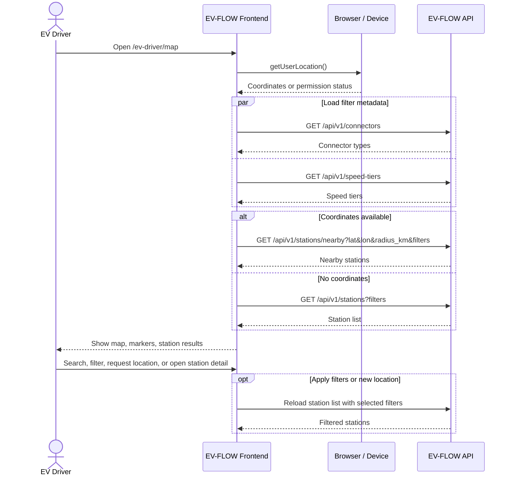
```mermaid
sequenceDiagram
  actor Driver as EV Driver
  participant UI as EV-FLOW Frontend
  participant Device as Browser / Device
  participant API as EV-FLOW API

  Driver->>UI: Open /ev-driver/map
  UI->>Device: getUserLocation()
  Device-->>UI: Coordinates or permission status
  par Load filter metadata
    UI->>API: GET /api/v1/connectors
    API-->>UI: Connector types
  and
    UI->>API: GET /api/v1/speed-tiers
    API-->>UI: Speed tiers
  end
  alt Coordinates available
    UI->>API: GET /api/v1/stations/nearby?lat&lon&radius_km&filters
    API-->>UI: Nearby stations
  else No coordinates
    UI->>API: GET /api/v1/stations?filters
    API-->>UI: Station list
  end
  UI-->>Driver: Show map, markers, station results
  Driver->>UI: Search, filter, request location, or open station detail
  opt Apply filters or new location
    UI->>API: Reload station list with selected filters
    API-->>UI: Filtered stations
  end
```

## 6. Wallet Overview And Transaction Detail

### Activity Diagram

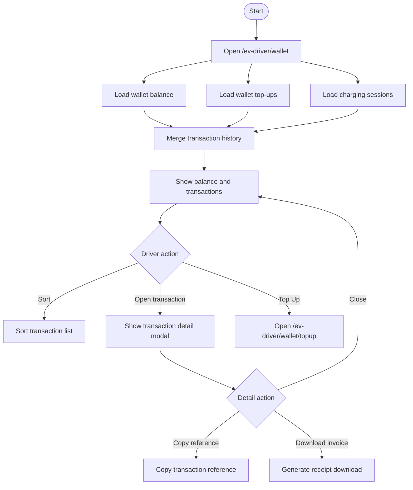
```mermaid
flowchart TD
  Start([Start]) --> OpenWallet[Open /ev-driver/wallet]
  OpenWallet --> LoadWallet[Load wallet balance]
  OpenWallet --> LoadTopups[Load wallet top-ups]
  OpenWallet --> LoadSessions[Load charging sessions]
  LoadWallet --> MergeHistory[Merge transaction history]
  LoadTopups --> MergeHistory
  LoadSessions --> MergeHistory
  MergeHistory --> ShowWallet[Show balance and transactions]
  ShowWallet --> WalletAction{Driver action}
  WalletAction -->|Sort| SortTransactions[Sort transaction list]
  WalletAction -->|Open transaction| OpenModal[Show transaction detail modal]
  WalletAction -->|Top Up| TopupRoute[Open /ev-driver/wallet/topup]
  OpenModal --> ModalAction{Detail action}
  ModalAction -->|Copy reference| CopyReference[Copy transaction reference]
  ModalAction -->|Download invoice| DownloadReceipt[Generate receipt download]
  ModalAction -->|Close| ShowWallet
```

### System Sequence Diagram

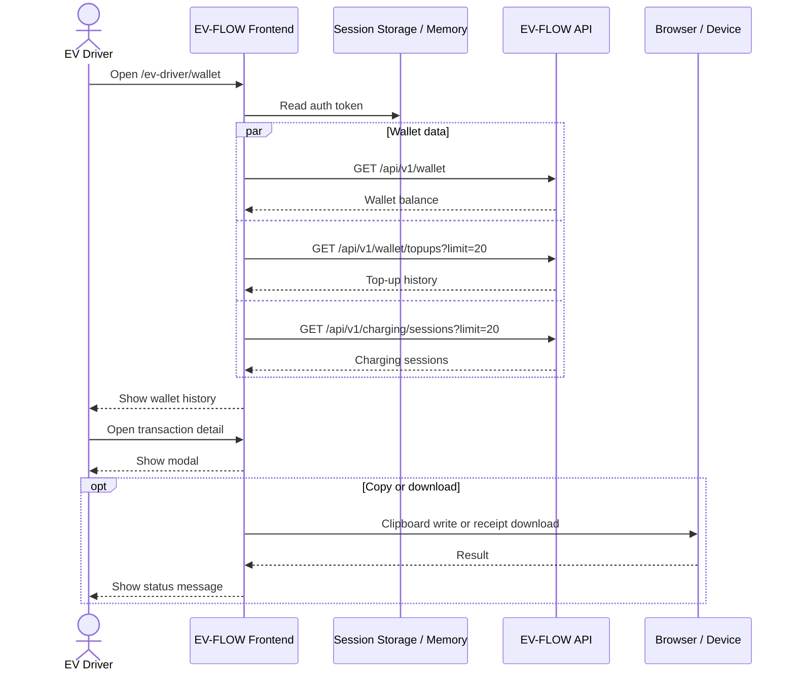
```mermaid
sequenceDiagram
  actor Driver as EV Driver
  participant UI as EV-FLOW Frontend
  participant Store as Session Storage / Memory
  participant API as EV-FLOW API
  participant Device as Browser / Device

  Driver->>UI: Open /ev-driver/wallet
  UI->>Store: Read auth token
  par Wallet data
    UI->>API: GET /api/v1/wallet
    API-->>UI: Wallet balance
  and
    UI->>API: GET /api/v1/wallet/topups?limit=20
    API-->>UI: Top-up history
  and
    UI->>API: GET /api/v1/charging/sessions?limit=20
    API-->>UI: Charging sessions
  end
  UI-->>Driver: Show wallet history
  Driver->>UI: Open transaction detail
  UI-->>Driver: Show modal
  opt Copy or download
    UI->>Device: Clipboard write or receipt download
    Device-->>UI: Result
    UI-->>Driver: Show status message
  end
```

## 7. Wallet Top-Up

### Activity Diagram

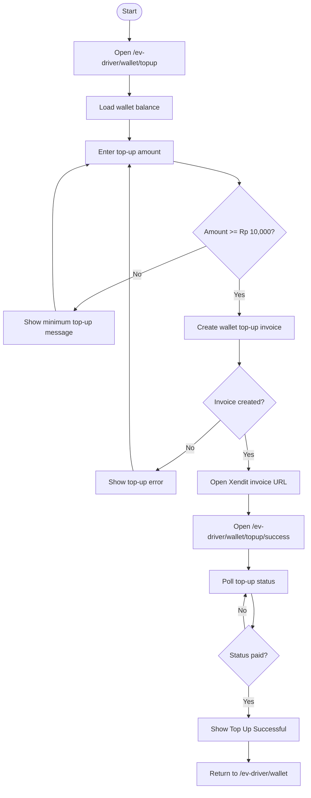
```mermaid
flowchart TD
  Start([Start]) --> OpenTopup[Open /ev-driver/wallet/topup]
  OpenTopup --> LoadBalance[Load wallet balance]
  LoadBalance --> EnterAmount[Enter top-up amount]
  EnterAmount --> ValidateAmount{Amount >= Rp 10,000?}
  ValidateAmount -->|No| ShowMinimum[Show minimum top-up message]
  ShowMinimum --> EnterAmount
  ValidateAmount -->|Yes| CreateInvoice[Create wallet top-up invoice]
  CreateInvoice --> InvoiceOk{Invoice created?}
  InvoiceOk -->|No| ShowError[Show top-up error]
  ShowError --> EnterAmount
  InvoiceOk -->|Yes| OpenXendit[Open Xendit invoice URL]
  OpenXendit --> Waiting[Open /ev-driver/wallet/topup/success]
  Waiting --> PollStatus[Poll top-up status]
  PollStatus --> Paid{Status paid?}
  Paid -->|No| PollStatus
  Paid -->|Yes| ShowSuccess[Show Top Up Successful]
  ShowSuccess --> Wallet[Return to /ev-driver/wallet]
```

### System Sequence Diagram

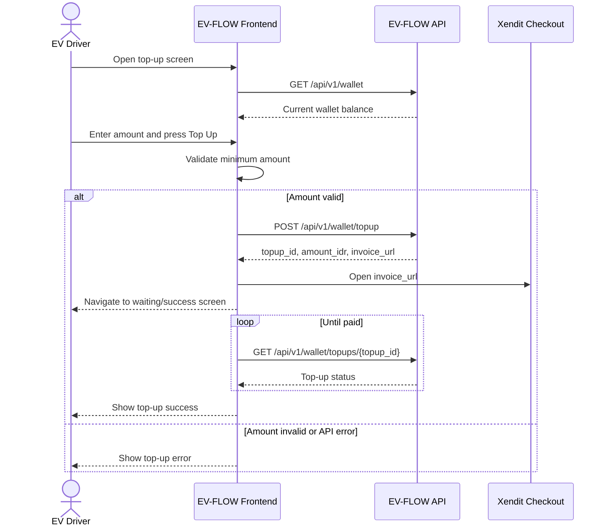
```mermaid
sequenceDiagram
  actor Driver as EV Driver
  participant UI as EV-FLOW Frontend
  participant API as EV-FLOW API
  participant Xendit as Xendit Checkout

  Driver->>UI: Open top-up screen
  UI->>API: GET /api/v1/wallet
  API-->>UI: Current wallet balance
  Driver->>UI: Enter amount and press Top Up
  UI->>UI: Validate minimum amount
  alt Amount valid
    UI->>API: POST /api/v1/wallet/topup
    API-->>UI: topup_id, amount_idr, invoice_url
    UI->>Xendit: Open invoice_url
    UI-->>Driver: Navigate to waiting/success screen
    loop Until paid
      UI->>API: GET /api/v1/wallet/topups/{topup_id}
      API-->>UI: Top-up status
    end
    UI-->>Driver: Show top-up success
  else Amount invalid or API error
    UI-->>Driver: Show top-up error
  end
```

## 8. Charging Session

### Activity Diagram

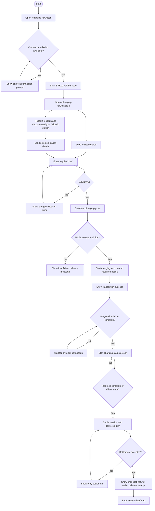
```mermaid
flowchart TD
  Start([Start]) --> OpenScan[Open /charging-flow/scan]
  OpenScan --> CameraAvailable{Camera permission available?}
  CameraAvailable -->|No| PromptCamera[Show camera permission prompt]
  PromptCamera --> CameraAvailable
  CameraAvailable -->|Yes| ScanQr[Scan SPKLU QR/barcode]
  ScanQr --> Initialize[Open /charging-flow/initialize]
  Initialize --> LoadWallet[Load wallet balance]
  Initialize --> SelectStation[Resolve location and choose nearby or fallback station]
  SelectStation --> LoadStation[Load selected station details]
  LoadWallet --> EnterEnergy[Enter required kWh]
  LoadStation --> EnterEnergy
  EnterEnergy --> ValidateEnergy{Valid kWh?}
  ValidateEnergy -->|No| ShowEnergyError[Show energy validation error]
  ShowEnergyError --> EnterEnergy
  ValidateEnergy -->|Yes| Quote[Calculate charging quote]
  Quote --> BalanceOk{Wallet covers total due?}
  BalanceOk -->|No| ShowBalanceError[Show insufficient balance message]
  BalanceOk -->|Yes| StartSession[Start charging session and reserve deposit]
  StartSession --> PaymentSuccess[Show transaction success]
  PaymentSuccess --> PluggedIn{Plug-in simulation complete?}
  PluggedIn -->|No| WaitPlug[Wait for physical connection]
  WaitPlug --> PluggedIn
  PluggedIn -->|Yes| Status[Start charging status screen]
  Status --> ChargingDone{Progress complete or driver stops?}
  ChargingDone -->|No| Status
  ChargingDone -->|Yes| Settle[Settle session with delivered kWh]
  Settle --> SettlementOk{Settlement accepted?}
  SettlementOk -->|No| RetrySettle[Show retry settlement]
  RetrySettle --> Settle
  SettlementOk -->|Yes| Complete[Show final cost, refund, wallet balance, receipt]
  Complete --> BackToMap[Back to /ev-driver/map]
```

### System Sequence Diagram

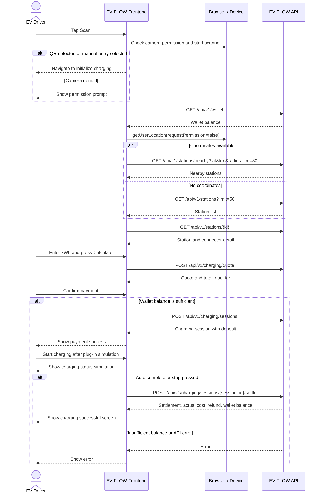
```mermaid
sequenceDiagram
  actor Driver as EV Driver
  participant UI as EV-FLOW Frontend
  participant Device as Browser / Device
  participant API as EV-FLOW API

  Driver->>UI: Tap Scan
  UI->>Device: Check camera permission and start scanner
  alt QR detected or manual entry selected
    UI-->>Driver: Navigate to initialize charging
  else Camera denied
    UI-->>Driver: Show permission prompt
  end

  UI->>API: GET /api/v1/wallet
  API-->>UI: Wallet balance
  UI->>Device: getUserLocation(requestPermission=false)
  alt Coordinates available
    UI->>API: GET /api/v1/stations/nearby?lat&lon&radius_km=30
    API-->>UI: Nearby stations
  else No coordinates
    UI->>API: GET /api/v1/stations?limit=50
    API-->>UI: Station list
  end
  UI->>API: GET /api/v1/stations/{id}
  API-->>UI: Station and connector detail
  Driver->>UI: Enter kWh and press Calculate
  UI->>API: POST /api/v1/charging/quote
  API-->>UI: Quote and total_due_idr
  Driver->>UI: Confirm payment
  alt Wallet balance is sufficient
    UI->>API: POST /api/v1/charging/sessions
    API-->>UI: Charging session with deposit
    UI-->>Driver: Show payment success
    Driver->>UI: Start charging after plug-in simulation
    UI-->>Driver: Show charging status simulation
    alt Auto complete or stop pressed
      UI->>API: POST /api/v1/charging/sessions/{session_id}/settle
      API-->>UI: Settlement, actual cost, refund, wallet balance
      UI-->>Driver: Show charging successful screen
    end
  else Insufficient balance or API error
    API-->>UI: Error
    UI-->>Driver: Show error
  end
```

## 9. EV Driver Navigation

### Activity Diagram

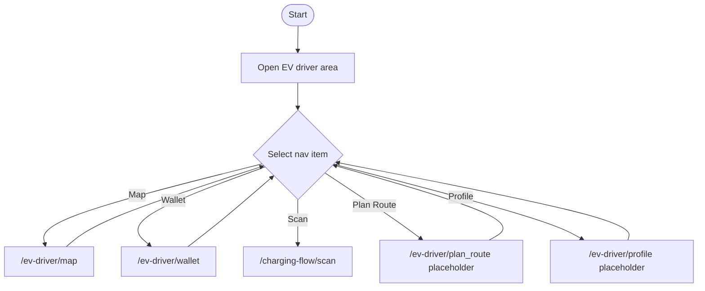
```mermaid
flowchart TD
  Start([Start]) --> DriverArea[Open EV driver area]
  DriverArea --> SelectNav{Select nav item}
  SelectNav -->|Map| Map["/ev-driver/map"]
  SelectNav -->|Wallet| Wallet["/ev-driver/wallet"]
  SelectNav -->|Scan| Scan["/charging-flow/scan"]
  SelectNav -->|Plan Route| Plan["/ev-driver/plan_route placeholder"]
  SelectNav -->|Profile| Profile["/ev-driver/profile placeholder"]
  Map --> SelectNav
  Wallet --> SelectNav
  Plan --> SelectNav
  Profile --> SelectNav
```

### System Sequence Diagram

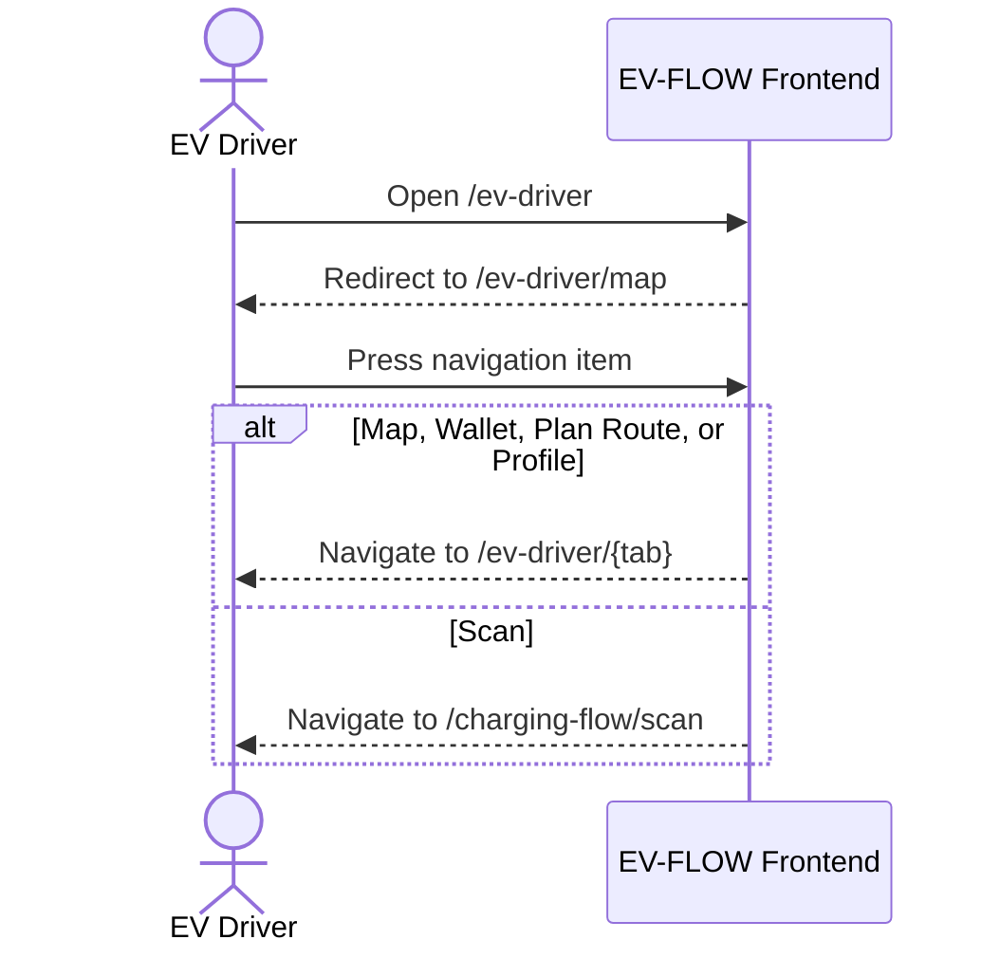
```mermaid
sequenceDiagram
  actor Driver as EV Driver
  participant UI as EV-FLOW Frontend

  Driver->>UI: Open /ev-driver
  UI-->>Driver: Redirect to /ev-driver/map
  Driver->>UI: Press navigation item
  alt Map, Wallet, Plan Route, or Profile
    UI-->>Driver: Navigate to /ev-driver/{tab}
  else Scan
    UI-->>Driver: Navigate to /charging-flow/scan
  end
```

## Implementation References

| Flow | Frontend files |
| --- | --- |
| Routes | `packages/features/src/routing/AppRoutes.tsx` |
| Login / forgot password | `packages/features/src/login/LoginScreen.tsx`, `packages/shared/src/auth/api.ts`, `packages/shared/src/auth/session.ts` |
| Registration | `packages/features/src/registration/RegistrationScreen.tsx`, `packages/shared/src/ev_models/api.ts`, `packages/shared/src/stations/api.ts` |
| Driver navigation | `packages/features/src/ev_driver/EVDriverContainer.tsx`, `packages/features/src/ev_driver/MockDriverScreen.tsx` |
| Map discovery | `packages/features/src/ev_driver/DriverMapScreen.tsx`, `packages/shared/src/stations/api.ts` |
| Wallet | `packages/features/src/ev_driver/WalletScreen.tsx`, `packages/features/src/ev_driver/TopUpWalletScreen.tsx`, `packages/shared/src/wallet/api.ts` |
| Charging | `packages/features/src/charging_flow/*`, `packages/shared/src/charging/api.ts` |
